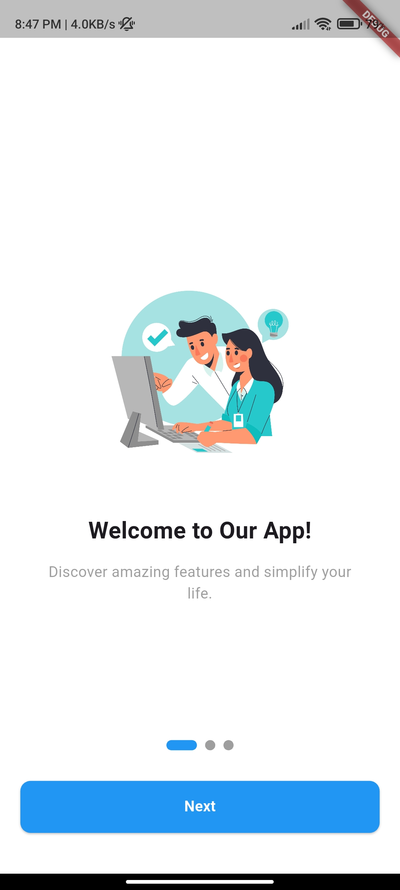
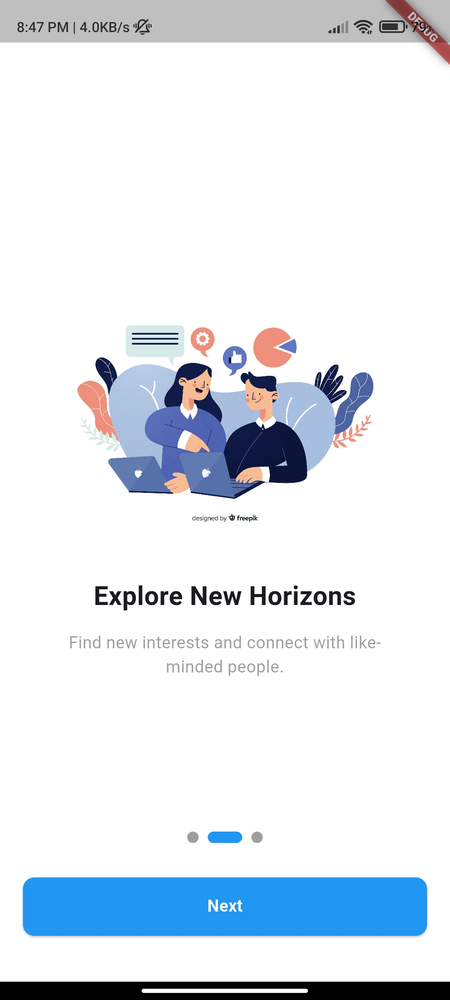

# 🚀 Onboarding Screens in Flutter

This Flutter project demonstrates a **clean and customizable onboarding screen flow**, ideal for introducing new users to your app. It uses a **page view-based layout** with smooth indicators and persistent state saving to ensure the onboarding screen only appears once.

## 📸 Features

* ✨ Beautiful, swipeable onboarding screens
* 📍 Smooth page indicators using the [`smooth_page_indicator`](https://pub.dev/packages/smooth_page_indicator) package
* 💾 Persistence with [`shared_preferences`](https://pub.dev/packages/shared_preferences) to save whether onboarding is completed
* 🖼️ Currently uses image assets, but easily supports Lottie animations
* 🔁 Automatically navigates to the home screen after onboarding is completed once

---

## 📦 Packages Used

### 1. `smooth_page_indicator`

Used to display **animated page indicators** (dots) that move smoothly as the user swipes between onboarding pages. The style can be customized — for example, this project uses the `WormEffect` to create a smooth worm-style animation.

```dart
SmoothPageIndicator(
  controller: _controller,
  count: onboardingPages.length,
  effect: const WormEffect(
    dotHeight: 12,
    dotWidth: 12,
    activeDotColor: Colors.blueAccent,
  ),
)
```

### 2. `shared_preferences`

This package is used to **store a flag locally** indicating whether the user has already seen the onboarding screens. If the flag is true, the onboarding screen is skipped on future app launches.

```dart
SharedPreferences prefs = await SharedPreferences.getInstance();
prefs.setBool('onboardingCompleted', true);
```

---

## 🎨 Animation: Use Lottie (Optional)

Currently, this project uses static **images** to display illustrations on the onboarding screens. However, you can **enhance the user experience** by replacing the images with **Lottie animations**.

### ✅ To use Lottie:

1. Add the [`lottie`](https://pub.dev/packages/lottie) package to your `pubspec.yaml`.
2. Replace the image widget with:

```dart
Lottie.asset('assets/animations/intro_animation.json')
```

This can bring your onboarding flow to life with rich, interactive animations.

## 🧠 How It Works

* On the first app launch, the onboarding screen is shown.
* After the user finishes onboarding, a boolean value is stored using `SharedPreferences`.
* On subsequent launches, the app reads that value and directly navigates to the Home screen if onboarding is already completed.

---

## 🚀 Getting Started

```bash
git clone https://github.com/mohankumaronly/Onboarding-Screens-in-the-flutter.git
cd Onboarding-Screens-in-Flutter
flutter pub get
flutter run
```

---

## 📌 Notes

* You can easily customize text, images, Lottie animations, and layout.
* Ideal for apps that need a quick and elegant onboarding experience.

---
## 📸 Screenshots

### 🧭 Onboarding Screen



